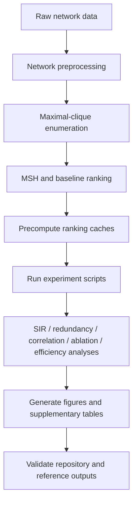

# Mesoscopic Structural Holes (MSH)

Code and data for reproducing the experiments in **Mesoscopic Structural Holes for Redundancy-Aware Node Ranking in Complex Networks**.

MSH is a topology-based node-ranking method for simple, unweighted, undirected graphs. The implementation computes the MSH constraint coefficient \(C_i\) and exports the equivalent priority score \(1-C_i\), so **larger scores indicate higher ranking priority**.

## Workflow



## Repository structure

```text
MSH/
├── README.md
├── requirements.txt
├── reproduce_all.py
├── msh_methods.py
├── hosh_methods.py
├── network_loader.py
├── precompute_rankings.py
├── configs/
│   └── revision_parameters.json
├── experiments/
├── tools/
├── tests/
├── reference_results/
├── networks_data/
└── results/
```

## Installation

Python 3.10 or later is recommended.

```bash
python -m pip install -r requirements.txt
```

## Data preprocessing

All empirical networks are converted to simple, unweighted, undirected graphs. Directed edges are symmetrized, repeated or temporal interactions are aggregated, self-loops are removed, the largest connected component is retained, and nodes are relabeled to consecutive integer IDs.

## Ranking and maximal-clique enumeration

Maximal cliques are enumerated exactly. The empirical ranking workflow uses `python-igraph` `Graph.maximal_cliques()`, while NetworkX `find_cliques()` is available as a fallback and is also used in the stress-test scripts.

For static rankings, ties are resolved by ascending node ID after relabeling. VoteRank also resolves internal voting-score ties by ascending node ID.

## Main parameter settings

- MSH stability constant: `1e-3`
- CI shell radius: `2`
- VoteRank initial voting ability: `1`
- VoteRank neighbor decrement: `1/<k>`
- VoteRank selected-node voting ability: `0`
- VoteRank internal tie-breaking: ascending node ID
- SNIM minimum maximal-clique size: `3`
- CHBC: Louvain, resolution `1`, random seed `42`

## Reproduction

Precompute ranking and clique caches:

```bash
python precompute_rankings.py --force
```

List the experiment workflow:

```bash
python reproduce_all.py --list
```

Check the workflow without running experiments:

```bash
python reproduce_all.py --dry-run
```

Run the complete workflow:

```bash
python reproduce_all.py
```

Individual scripts in `experiments/` can also be run separately.

## Validation

```bash
python -m tools.validate_repository
python -m tools.validate_reference_results
pytest -q
```

The validation checks repository structure, datasets, reference outputs, source syntax, and deterministic ranking rules.
