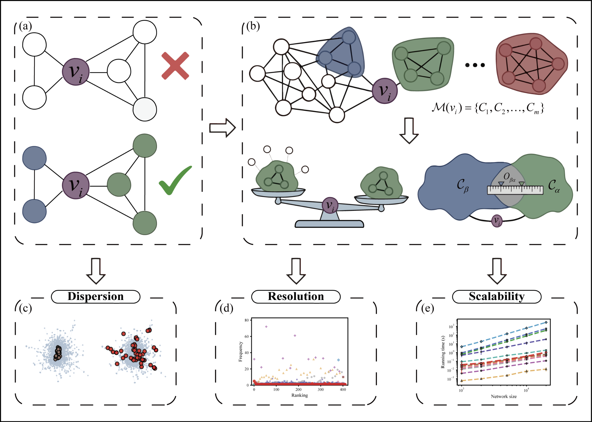

# Mesoscopic Structural Holes (MSH)

MSH is a topology-based node-ranking method for simple, unweighted, undirected networks. It uses maximal cliques as mesoscopic cohesive units and combines effective dependence with inter-clique redundancy to quantify the structural priority of each node.

The method defines a constraint coefficient `C_i`, where a smaller value indicates a stronger mesoscopic structural-hole position. The code uses the equivalent priority score `1 - C_i`, so **larger score = higher ranking priority**.

## Workflow



## Repository structure

```text
MSH/
├── README.md
├── requirements.txt
├── reproduce_all.py
├── msh_methods.py
├── hosh_methods.py
├── network_loader.py
├── precompute_rankings.py
├── configs/
│   └── parameters.json
├── docs/
│   ├── DATASETS.md
│   ├── REPRODUCIBILITY.md
│   ├── STATISTICAL_PROTOCOL.md
│   └── figure_table_manifest.csv
├── experiments/
├── tools/
├── tests/
├── reference_results/
├── networks_data/
├── images/
└── results/
```

## Installation

Python 3.10 or later is recommended.

```bash
python -m pip install -r requirements.txt
```

## Quick start

Precompute rankings and maximal-clique caches:

```bash
python precompute_rankings.py --force
```

List all available analysis steps:

```bash
python reproduce_all.py --list
```

Run the complete workflow:

```bash
python reproduce_all.py
```

Run selected steps only:

```bash
python reproduce_all.py --only fig3 fig10 fig11data fig11
```

Additional options are available with:

```bash
python reproduce_all.py --help
```

## Data

The empirical network files are stored in `networks_data/`. The loader converts each dataset to a simple, unweighted, undirected graph, removes self-loops, retains the largest connected component, and relabels nodes to consecutive integer IDs.

Dataset paths and source notes are listed in `docs/DATASETS.md`.

## Main settings

Fixed method and simulation settings are stored in `configs/parameters.json`.

Key implementation choices include:

- exact maximal-clique enumeration;
- CI shell radius: `2`;
- VoteRank voting-score ties: ascending node ID;
- SNIM minimum maximal-clique size: `3`;
- CHBC: Louvain, resolution `1`, random seed `42`;
- SIR experiments: 50 Monte Carlo blocks × 20 realizations per block;
- one block mean is treated as one statistical observation.

For static rankings, score ties are resolved by ascending node ID after relabeling. Monotonicity and Kendall `tau_b` analyses retain score ties.

## Reproducing figures and tables

Each analysis is implemented as an independent script in `experiments/`. The mapping between scripts and generated figures/tables is provided in:

```text
docs/figure_table_manifest.csv
```

Generated outputs are written under `results/`.

## Validation

Run the lightweight repository and reference-output checks with:

```bash
python -m tools.validate_repository
python -m tools.validate_reference_results
pytest -q
```

These checks validate repository structure, dataset availability, reference tables, source syntax, and deterministic VoteRank tie handling without rerunning the full SIR workflow.
